# 🧭 “Data Flow at a Glance”

## 🎯 Purpose
A high-level overview of how data flows through my ecosystem: ingestion, storage, notification, and display—covering both infrastructure and design principles.

## 🔗 Related Repositories
- microservices : Collection of Python containers that fetch and publish live AQI, Weather, Moon, Family Event, Google Calendar, GitHub, MLB, and NFL data.
- APIServer : Acts as the central API hub and Redis event listener.
- nodewebdisplay : Front-end visual dashboard, now SSE-enabled for real-time updates.

## 📡 Real-Time Pipeline

Data Flow (Blue links are one time at start-up only):

Sequence Diagram:

```mermaid
sequenceDiagram
    participant Microservice
    participant Redis  as Redis 🧠
    participant Redis Snapshot as ⬆️ Redis Snapshot
    participant KV Updater as 🔁 KV Updater
    participant APIserver as 🖥️ APIserver
    participant Web/Matrix Client as 🌐 Web/Matrix Client
    Redis Snapshot->>+Redis: Load Snapshot
    APIserver->>+Redis: Read KV state (startup only)
    KV Updater->>+Redis: SUBSCRIBE 'update:{rich}'
    APIserver->>+Redis: SUBSCRIBE 'update:{rich}'
    APIserver->>+Web/Matrix Client: READ State
    Web/Matrix Client->>+APIserver: REQUEST SSE
    Microservice->>+Redis: PUBLISH 'update:{rich}'
    Redis->>+KV Updater: REPUBLISH 'update:{rich}'
    note over APIserver,Web/Matrix Client: SSE streams until disconnect
    KV Updater->>+Redis: WRITE KV Update
    Redis->>+Redis Snapshot: WRITE Snapshot
    Redis->>+APIserver: REPUBLISH 'update:{rich}'
    APIserver->>+Web/Matrix Client: SEND SSE
    note over Redis, Redis Snapshot: Internal to Redis
```

## 🧩 Tech Stack Highlights
- React + Bootstrap + Custom modules
- Redis pub/sub messaging for push efficiency
- Server-Sent Events (SSE) for display sync
- Kubernetes-deployed services, each containerized
- GitHub Actions CI/CD with automated image builds

## 🚀 Design Goals
- 🔒 Security-first: internal state (Redis) only accessed from inside the cluster
- 🔔 Decoupled updates: Redis notifies without blocking
- ♻️ Resilient render: display updates gracefully if data is delayed or unavailable
- 🎨 Expression-ready: dashboard supports curated, modular content including Moon phases, AQI, game stats, and more

## Project Plan:

*Note:* kanban _state_ is for illustrative purposes.  *All tasks* are actually complete.