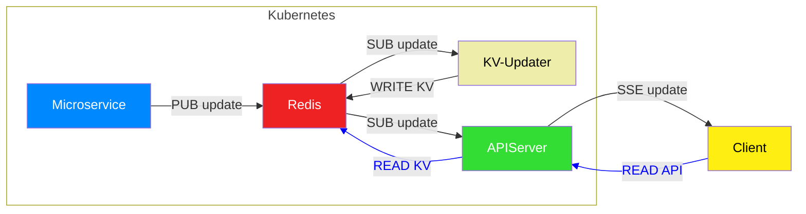

# 🌐 Redis API Server with SSE
Real-time API layer for Redis-backed state updates.
This FastAPI service listens to a Redis pub/sub channel and exposes endpoints for both current state retrieval and real-time streaming via Server-Sent Events (SSE).

## 🚀 Overview
This service is the final step in a Redis-first architecture chain. It:
- Subscribes to a Redis pub/sub channel for updates.
- Serves current Redis KV data via REST endpoints.
- Streams updates to connected clients using SSE.
- Supports web control commands via PUT requests.

## 🧩 Features
- 🔄 Live updates via /events SSE endpoint
- 📦 State retrieval via /key/{KV_KEY} and /key/Environment
- 🎮 Web control interface via /webcontrol/{command}
- ⚙️ Async Redis integration using redis.asyncio
- 🌍 CORS support for frontend development

## 🗺️ API Endpoints
| Method | Endpoint | Description | 
|---|---|---|
| GET | /key/{KV_KEY} | Returns the current value of a Redis key | 
| GET | /key/Environment | Aggregates Weather, AQI, and Moon keys | 
| GET | /events | SSE stream of updates from Redis pub/sub | 
| PUT | /webcontrol/{command} | Broadcasts a control command (pp, fwd, etc.) | 


## 🔁 Data Flow


## ⚙️ Configuration
Settings are loaded from config.py. Example:
```python
config = {
    "redis_url": "redis://redis.redis:6379/0",
    "update_channel": "update"
}
```


## 🧪 Local Development
1. Install dependencies
```sh
pip install fastapi uvicorn redis sse-starlette
```

2. Run the server
```sh
python apiserver.py
```

Or with hot reload:
```sh
uvicorn apiserver:app --reload
```


## 🔐 CORS
CORS is enabled for http://localhost:3001 to support local frontend development. Adjust as needed in:
allow_origins=["http://localhost:3001"]


## 📡 SSE Notes
- Clients connect to /events for real-time updates.
- Messages are broadcasted from Redis pub/sub and internal control commands.
- Disconnected clients are automatically removed from the broadcast list.

## 🧠 Web Control Commands
Accepted commands via /webcontrol/{command}:
- pp — Pause/play
- fwd — Fast forward
- rew — Rewind
- out — Exit or shutdown
These are broadcasted as:
```json
{
  "type": "webcontrol",
  "command": "pp"
}
```


## 📓 Logging
- INFO: Connection events, key fetches
- ERROR: Redis or SSE issues
- DEBUG: Available if logging level is adjusted

## 📦 Deployment
To restart the deployment in Kubernetes:
kubectl rollout restart -n default deployment apiserver


## 📚 License
MIT License — open for use and contributions.
