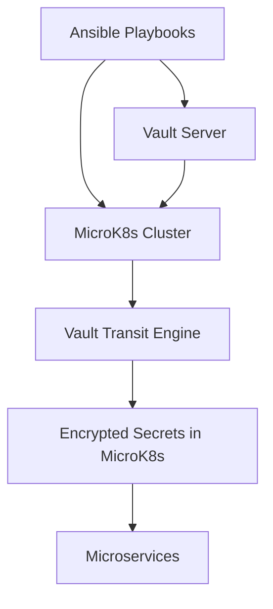

# 🏡 Homelab Ecosystem Overview
Welcome to the DeKeyrel Homelab Ecosystem, a modular, Redis-first architecture designed for declarative automation, secure secrets management, and real-time microservice orchestration.
This site documents the core components, patterns, and roles that power the system—each built to be composable, transparent, and open-source.

## 🧭 Architectural Flow

## 🔍 Overview
High-level summary of the homelab architecture, guiding principles, and role-based structure.
## 🔐 Vault
Provisioning and configuring HashiCorp Vault via Ansible, including Kubernetes authentication and transit encryption.
## ⚙️ MicroK8s
Cluster setup using Ansible, plugin enablement, and Vault integration for secrets management.
## 🗝️ Secret Manager
Lifecycle of secrets: encrypted via Vault Transit, stored in MicroK8s, and consumed by microservices at runtime.

## 🧩 Related Repositories

| Repo | Purpose | 
|---|---|
| [Ansible](https://github.com/dekeyrej/ansible) | Core automation roles for provisioning and configuration | 
| [SecretManager](https://github.com/dekeyrej/secretmanager) | Secrets lifecycle and templating logic | 
| [MicroServiceMatrix](https://github.com/dekeyrej/microservicematrix) | Collection of microservices | 
| [KVUpdater](https://github.com/dekeyrej/kv-updater) | Redis-first state update service | 
| [APIServer](https://github.com/dekeyrej/apiserver) | SSE-providing API gateway for microservices | 
| [MatrixClient](https://github.com/dekeyrej/matrixclient) | SSE-driven RGB LED Frontend display for real-time data | 
| [WebDisplay](https://github.com/dekeyrej/nodewebdisplay) | SSE-driven Web Frontend display for real-time data | 

## 🧠 Philosophy
This ecosystem is built on the belief that:
- Declarative automation reduces complexity.
- Redis-first architecture enables real-time responsiveness.
- Secrets should be encrypted, not just stored.
- Documentation is part of the product.

---
