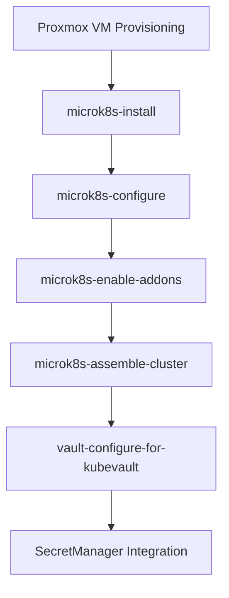

# 🧬 MicroK8s Integration: Vault-Hardened Kubernetes in the Homelab

This document outlines the MicroK8s portion of the homelab automation flow, focusing on secure cluster provisioning, certificate injection, and Vault integration for secrets management.

MicroK8s is installed on Proxmox-provisioned VMs and configured to use a custom RFC 5280-compliant Certificate Authority. Vault is used to deliver secrets securely to Kubernetes workloads via the Transit and Kubernetes auth engines.

---

## 🛠️ Roles Involved

| Role                         | Description                                           |
|------------------------------|-------------------------------------------------------|
| `microk8s-install`           | Installs MicroK8s and injects custom CA              |
| `microk8s-configure`         | Applies configuration overrides                      |
| `microk8s-enable-addons`     | Enables required MicroK8s addons (e.g., DNS, RBAC)   |
| `microk8s-assemble-cluster`  | Joins nodes into a cohesive cluster                  |
| `vault-configure-for-kubevault` | Configures Vault for Kubernetes auth and Transit engine |

---

## 🔐 Certificate Injection

MicroK8s nodes receive the custom `ca.crt` and `ca.key` generated by the `certificate-authority` role. These are injected during installation and refreshed using:

```bash
microk8s refresh-certs
```

This ensures compatibility with Python 3.13 and Vault’s TLS requirements.

## 🔗 Vault Integration
Vault is configured to support:
- Kubernetes Authentication: Enables workloads to authenticate using service accounts
- Transit Secrets Engine: Provides AES-256 encryption/decryption as a service
This is handled by the vault-configure-for-kubevault role, which uses the root token from Vault initialization.

## 🖼️ Cluster Provisioning Flow

---

## ✅ Result

Once configured, Vault-backed secrets are available to Kubernetes workloads. The SecretManager examples (encryptonator.py, readstub.py, recryptonator.py) demonstrate secure, real-time encryption workflows.

---

## 🔭 Roadmap
- Improve cloud-init templating for MicroK8s base images
- Replace certificate patching once MicroK8s supports modern key usages
- Add validation role to verify Vault–Kubernetes integration

---

### In `vault.md`
Vault is provisioned via Ansible and integrated with MicroK8s for Kubernetes-based authentication. See microk8s.md for cluster setup and secretmanager.md for secrets templating and consumption.

### In `microk8s.md`
This role configures MicroK8s to authenticate with Vault and enables secrets encryption via Vault Transit. See vault.md for Vault provisioning and secretmanager.md for secrets usage patterns.

### In `secretmanager.md`
Secrets are encrypted using Vault Transit and consumed by microservices deployed in MicroK8s. See vault.md for encryption setup and microk8s.md for cluster integration.
