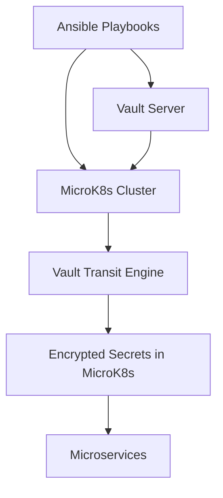

# 🧭 Updated Flow Overview
Here’s a refined breakdown of your architecture:
## 1. 🔧 Vault Provisioning
- Ansible sets up Vault (install, init, unseal, policy creation).
## 2. 🔐 Vault ↔ MicroK8s Integration
- Vault auth method enabled for Kubernetes.
- MicroK8s configured to authenticate with Vault (via service account + role binding).
## 3. 🔁 Secrets Encryption via Vault Transit
- Secrets stored in MicroK8s (e.g., ConfigMaps or Secrets) are encrypted/decrypted using Vault’s transit engine.
- Ansible may pre-encrypt secrets or configure workloads to use Vault Transit at runtime.
## 4. 🚀 Secrets Consumption by Microservices
- Microservices (deployed in MicroK8s) fetch or decrypt secrets during init.
- Could be via sidecar, init container, or direct Vault API call.

---

### In `vault.md`
Vault is provisioned via Ansible and integrated with MicroK8s for Kubernetes-based authentication. See microk8s.md for cluster setup and secretmanager.md for secrets templating and consumption.

### In `microk8s.md`
This role configures MicroK8s to authenticate with Vault and enables secrets encryption via Vault Transit. See vault.md for Vault provisioning and secretmanager.md for secrets usage patterns.

### In `secretmanager.md`
Secrets are encrypted using Vault Transit and consumed by microservices deployed in MicroK8s. See vault.md for encryption setup and microk8s.md for cluster integration.