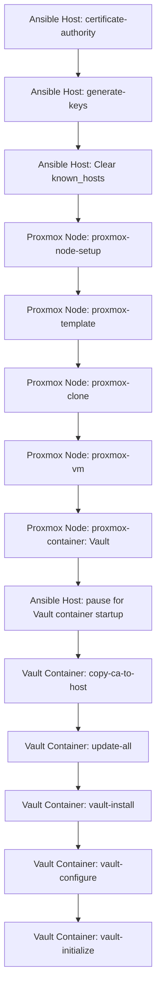

# 🔐 Vault Integration: Protecting Secret-Zero in a Homelab

This document outlines the current state of my hybrid Kubernetes–HashiCorp Vault solution, implemented in Python via the [SecretManager repository](https://github.com/dekeyrej/secretmanager). It assumes:

- A running MicroK8s cluster
- A properly configured Vault instance
- Python 3.13 environment

There are ongoing challenges around Certificate Authority (CA) compliance, server certificate generation, and Python compatibility. Until MicroK8s updates its snap to produce RFC 5280-compliant CAs, the automation remains somewhat convoluted.
The manual process to work through issues is reflected [here](https://github.com/dekeyrej/secretmanager/blob/main/python_ssl_summary.md).

---

## 🧭 Overview of the Current Flow

### 🖥️ Ansible Host

1. **Inventory Definition** 
```ini
[vault]
moria     ansible_host=192.168.86.9  vmid=106 type=lxc
```
2. **Role:** `certificate-authority` 
- Creates an RFC 5280-compliant CA (ca.key, ca.crt)
- Includes proper keyUsage extensions

3.  **Role:** `generate-keys` 
- Generates `server.key` and RFC 2818-compliant `server.crt`
- Includes IP SANs
- Uses `host_group: vault` as a variable

---

### 🖥️ Proxmox-VE Node

4. **Role:** `proxmox-container`
- Provisions an LXC container for Vault
- Uses `host_group: vault`

---

### 🔐 Vault Container

5. **Role:** `copy-ca-to-host`
- Copies ca.crt to the Vault container
- Adds it to the system certificate stor

6. **Role:** `vault-install`
- Adds Vault as an apt source
- Installs Vault

7. **Role:** `vault-configure` 
- Copies `server.key` and `server.crt` to the Vault container
- Updates Vault config and environment
- Deploys encrypted `application_default_credentials.json` for GCP auto-unseal
- Starts the Vault service

8. **Role:** `vault-initialize`
- Initializes Vault (auto-unseal should succeed)
- Captures root token and recovery keys
- Fetches secrets back to the Ansible host

---

### 🧬 MicroK8S (before cluster is formed)
9. **Role:** `microk8s-install`
- Installs MicroK8s
- Injects `ca.crt` and `ca.key` into nodes
- Runs `microk8s.refresh-certs`

---

### 🧠 Final Configuration (from Ansible host)
10. **Role:** `vault-configure-for-kubevault` using the initial root token, configures vault for Kubernetes authentication and `Transit` AES-256 encryption/decryption as a Service.

---

### ✅ Result
At this point, the SecretManager examples should function as designed:
- encryptonator.py
- readstub.py
- recryptonator.py

These demonstrate secure, Vault-backed encryption workflows integrated with Kubernetes workloads.

---

### 🔭 Future Improvements
- Await MicroK8s patch for RFC 5280-compliant CA generation
- Replace certificate patching with native support for modern key usages
- Add validation role to verify Vault and Kubernetes integration

## 🖼️ End-to-End Playbook Flow

The following diagram illustrates the full automation sequence defined in `playbooks/00_proxmox.yaml`, from CA creation to Vault initialization:



This playbook coordinates tasks across:
- The Ansible host (certificate generation, key creation)
- Proxmox nodes (VM and container provisioning)
- The Vault container (installation, configuration, and initialization)
Each role is modular and reusable, allowing for flexible orchestration across different environments.

---

### In `vault.md`
Vault is provisioned via Ansible and integrated with MicroK8s for Kubernetes-based authentication. See microk8s.md for cluster setup and secretmanager.md for secrets templating and consumption.

### In `microk8s.md`
This role configures MicroK8s to authenticate with Vault and enables secrets encryption via Vault Transit. See vault.md for Vault provisioning and secretmanager.md for secrets usage patterns.

### In `secretmanager.md`
Secrets are encrypted using Vault Transit and consumed by microservices deployed in MicroK8s. See vault.md for encryption setup and microk8s.md for cluster integration.
